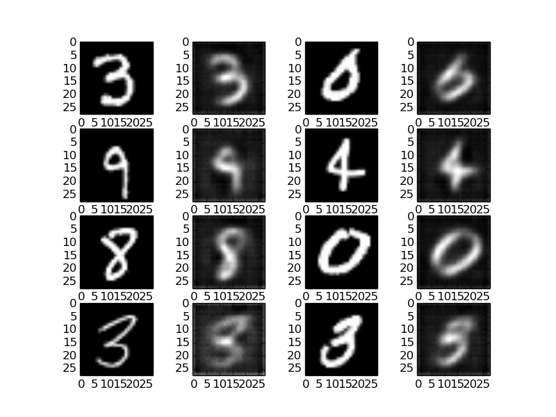
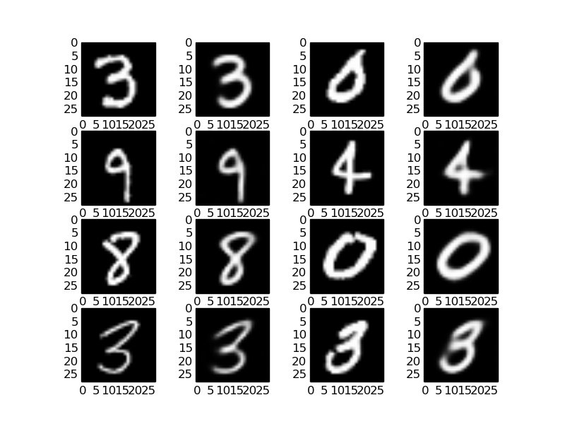
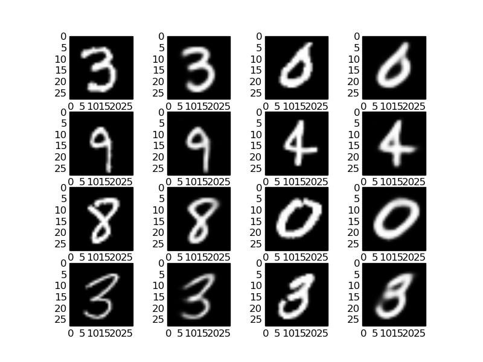
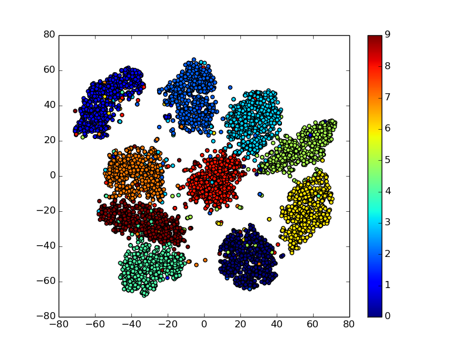

# CNN AutoEncoder on MNIST 

A simple autoencoder to recover MNIST data using convolutional and de-convolutional layers.

# Usage

Train an AutoEncoder, generate recoverd images, and do t-sne on embeddings.

```shell
    python main.py
```

# Recovered Image

The dimension of embedding is `10`.

Fig.1 and Fig3 in each row are `real images`, Fig.2 and Fig.4 in each row are `recovered images`.

*Epoch 0* | *Epoch 5* | *Epoch 9*
:---: | :---: | :---: 
 |  |  | 

# t-sne visualization of embeddings

Use t-sne to reduce embeddings' dimension `10` down to `2`, so as to scatter in a coordinate system.

<center>


